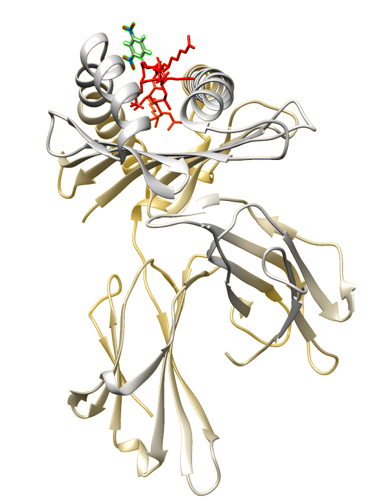

```{r setup, include=FALSE, warning=FALSE}
options(htmltools.dir.version = FALSE)
library(tidyverse)
library(UpSetR)
library(ggseqlogo)
library(kableExtra)

# Load HaCaT data
dat <- readRDS("../HaCaT_feb_2018/outputs/dat.RDS")

dat_sub <- dat %>% select(peptide,length,exp_name,accession) %>% 
  filter(length >= 8 & length <= 15, str_detect(accession,"HUMAN")) %>% 
  mutate(exp_type = if_else(str_detect(exp_name,"^C"), 
                                         "Control","DNCB"),
         peptide = str_replace_all(peptide,"\\(.*?\\)", ""))

wt_logos <- read_rds("data/hacat-wt-pred-logos-dat.rds")
iedb_wt_logos <- read_rds("data/ideb-wt-logos-dat.rds")
ideb_a2_logos <- read_rds("data/iedb-logos-A2.rds")
a2_logos <- read_rds("data/hacat-A2-pred-logos.rds")
bind_plot <- read_rds("../HaCaT_june_2018/outputs/hacat_wt_pred_binders_plot.RDS")
a2_bind_plot <- read_rds("../HaCaT_june_2018/outputs/hacat_pred_binders_plot.RDS")

glut_sub <- read_rds("data/glut_sub.RDS")
ker_sub <- read_rds("data/ker_sub.RDS")

# Marine-1, Horizon-1, Horizon-3, Marine-2, Horizon-2
my_cols <- c("#005C84","#FCBC00","#E73037","#74C9E5","#EF7D00")
```
class: inverse
background-image: url(img/rakeboarding.png)
background-size: contain

---

class: right
background-image: url(img/oesophageal-cancer-figure-1.jpg)
background-position: left
background-size: contain

# Cancer proteomics

---

class: inverse,center,top
background-image: url(img/tasmanian-devil.jpg)
background-position: center
background-size: contain

# .content-box-marine[Tasmanian Devil proteomics]

---

class: center,right
background-image: url(img/Blausen_0014_AllergicDermatitis.png)
background-position: left
background-size: contain

# Skin sensitiser proteomics

---

class: inverse,middle

.pull-left[

# Papers for 2019

+ Skin sensitiser peptidomes and protein turnover
+ Skin sensitiser whole cell proteomics
+ Oesophageal cancer peptidome
+ Tasmanian Devil peptidomes
+ Tasmanian Devil DFT2 origins
]

.pull-right[
<video width=600 height=600 autoplay loop> 
<source src="assets/wk3AUOvx86YTUSiw.mp4" type="video/mp4"/>
</video>
]

---
class: center,right
background-image: url(img/Blausen_0014_AllergicDermatitis.png)
background-position: left
background-size: contain

# Skin sensitiser proteomics

---

class: split-two 

.column.inverse[.content.vmiddle.center[

# .horizon-1.huge.bolder[TEAM]
]]

.column.horizon-1-slide[.content.vmiddle.center[

# .huge.bolder[SCIENCE]
]]

---

class: split-two 

.column.inverse[.content[

# Southampton

### Elliott Group
- Tim Elliott
- .horizon-1.bold[Rachel Darley]
- .horizon-1.bold[Nasia Kontouli]

### Centre for Proteomic Research
- Paul Skipp
- .horizon-1.bold[Ben Nicholas]
- Sergio Regufe Da Mota
- Erika Parkinson

]]

.column.horizon-1-slide[.content[

# Elsewhere 

- .bold[Unilever:] Gavin Maxwell, Maja Aleksic
- .bold[Oxford:] Nicola Ternette, Annalisa Nicastri
- .bold[Monash:] Tony Purcell, Pat Illing, Sri Ramarathinam
- .bold[Lausanne:] Michal Bassaini-Sternberg
- .bold[The R community]

]]

---

class: inverse, center,middle

# Skin sensitisation is induced by the .horizon-1.bold[haptenation] of proteins

---
class: inverse
background-image: url(img/donor-card.png)
background-size: contain
---
class: inverse
background-image: url(img/tinder-dncb.png)
background-size: contain

---

class: split-two 

.column.inverse[.content.center.vmiddle[

# Hypothesis

.horizon-1.bold[DNCB] (2,4-Dinitrochlorobenzene) and .horizon-1.bold[DPCP] (Diphenylcyclopropenone)
modified peptides stimulate CD8+ T-cells

]]

.column.horizon-1-slide[.content.middle.center[

```{r,out.width="85%",echo=FALSE}

```
]]

---

class: split-two 

.column.inverse[.content.center.vmiddle[

# Hypothesis

.horizon-1.bold[DNCB] (2,4-Dinitrochlorobenzene) and .horizon-1.bold[DPCP] (Diphenylcyclopropenone)
modulate the peptidome

]]

.column.horizon-1-slide[.content.middle.center[

]]

---
class: split-two 

.column.inverse[.content.center.vmiddle[

Number of peptide N-mers, n = 6

```{r, fig.retina=4,echo=FALSE}
dat_sub %>% 
  select(length, exp_type, exp_name) %>% 
  group_by(length, exp_name) %>% 
  mutate(n_peps = n()) %>% 
  ungroup() %>% 
  distinct() %>% 
  group_by(length,exp_type) %>% 
  summarise(mean_peps = mean(n_peps), sqn = sqrt(n()),  sem = sd(n_peps)/sqn) %>%
  ggplot(aes(x = length, y = mean_peps,fill = exp_type)) +
  geom_bar(stat='identity') +
  geom_errorbar(aes(ymin=mean_peps-sem, ymax=mean_peps+sem),
                width=.2) +
  scale_x_continuous(breaks=seq(8, 15, 1)) +
  theme_minimal(base_size = 16) +
  theme(legend.position = "") +
  xlab("Peptide length") +
  ylab("Number of peptides") +
  #scale_fill_brewer(palette="Set1") +
  scale_fill_manual(values = my_cols[c(1,3)]) +
  facet_wrap(~ exp_type)
```

]]

.column.inverse[.content.center.vmiddle[

Percentage of peptide N-mers, n = 6

```{r, fig.retina=4,echo=FALSE}
dat_sub %>% 
  select(length, exp_type, exp_name) %>% 
  group_by(exp_name, length) %>% 
  summarise(n = n()) %>% 
  mutate(f_peps = n/sum(n), 
         exp_type = if_else(str_detect(exp_name,"^C"), 
                                         "Control","DNCB")) %>% 
  ungroup() %>%
  distinct() %>% 
  group_by(exp_type,length) %>% 
  summarise(mean_peps = mean(f_peps), sqn = sqrt(n()),  sem = sd(f_peps)/sqn) %>%
  ggplot(aes(x = length, y = mean_peps,fill = exp_type)) +
  geom_bar(stat='identity') +
  geom_errorbar(aes(ymin=mean_peps-sem, ymax=mean_peps+sem),
                width=.2) +
  scale_x_continuous(breaks=seq(8, 15, 1)) +
          scale_y_continuous(labels=scales::percent, limits = c(0,0.6)) +
  theme_minimal(base_size = 16) +
  theme(legend.position = "") +
  xlab("Peptide length") +
  ylab("Percentage of peptides") +
  #scale_fill_brewer(palette="Set1") +
  scale_fill_manual(values = my_cols[c(1,3)]) +
  facet_wrap(~ exp_type)
```

]]
---

class: split-two 

.column.inverse[.content.center.vmiddle[

Intersection between all peptides

```{r, upset-plot,fig.retina=4, fig.asp=0.8,out.width="100%", echo=FALSE}

du <- dat_sub %>% 
  select(peptide, exp_type) %>% 
  group_by(exp_type,peptide) %>% 
  distinct() %>% 
  tally() %>% 
  mutate(n = as.integer(n)) %>% 
  spread(exp_type,n, fill = 0) %>%
  mutate(peptide = as.factor(peptide))

upset(as.data.frame(du), nsets = 2,  
      number.angles = 0, point.size = 5, 
      line.size = 2,order.by = "freq", 
      main.bar.color = my_cols[1], 
      matrix.color = my_cols[2], 
      sets.bar.color = my_cols[c(1,3)],
      mainbar.y.label = "Peptide Intersections", sets.x.label = "Number of Peptides",
      text.scale = 1.6)
```

]]

.column.horizon-1-slide[.content.center.vmiddle[

Intersection of 9-mers

```{r, upset-2,upset-plot,fig.retina=4,fig.asp=0.8,out.width="100%", echo=FALSE}
du2 <- dat_sub %>% 
  filter(length == 9) %>% 
  select(peptide, exp_type) %>% 
  group_by(exp_type,peptide) %>% 
  distinct() %>% 
  tally() %>% 
  mutate(n = as.integer(n)) %>% 
  spread(exp_type,n, fill = 0) %>%
  mutate(peptide = as.factor(peptide))

upset(as.data.frame(du2), nsets = 2,  
      number.angles = 0, point.size = 5, 
      line.size = 2,order.by = "freq", 
      matrix.color = my_cols[2], 
      main.bar.color = my_cols[1], 
      sets.bar.color = my_cols[c(1,3)],
      mainbar.y.label = "Peptide Intersections", sets.x.label = "Number of Peptides", 
      text.scale = 1.6)
```

]]

---

class: split-two

.column.inverse[.content.center.vmiddle[

Immune epitope database peptides

```{r, iedb-logos, fig.retina=4, echo=FALSE,fig.asp=0.8,out.width="100%",message=F}
# IEDB logos
ggseqlogo(iedb_wt_logos)
```

]]

.column.horizon-1-slide[.content.center.vmiddle[

Peptide classification model

```{r, wt_logos,fig.retina=4,fig.asp=0.8,out.width="100%", echo=FALSE}
ggseqlogo(wt_logos)
```

]]

???

There were 1000 9-mer peptides for each allotype for the IEDB peptides

---
class: inverse

```{r, wt_preds,fig.retina=6,echo=FALSE,fig.asp=0.6,out.width="100%"}
bind_plot + scale_fill_gradient(low = my_cols[5], high = my_cols[1]) +
  labs(title = "Identified NetMHC binding predicted 9-mer peptides ",
      subtitle = "Predicted binders in blue") 
```

---

class: split-two

.column.inverse[.content.center.vmiddle[

## DNCB modified peptides

HLA-B*40:01, 9mer, .horizon-1.bold[AETEC(+DNP)RYAL], <br> Keratin type I cytoskeletal 13

HLA-A*31:01, 10mer, .horizon-1.bold[RFC(+DNP)PFAERTR], Glutathione S-transferase omega-1 

]]

.column.horizon-1-slide[.content.center.vmiddle[

```{r dncb-mods-table, out.width="100%",echo=FALSE}
# Find DNCB modifications
DT::datatable(dat %>% 
               filter(str_detect(peptide,"\\+166"), length >= 8 & length <= 15) %>% 
  select(peptide,scan,exp_name,length,accession) %>% 
  mutate(prot_id = (str_extract(accession,"(sp\\|)(.*?)(\\|)") %>% 
  str_replace_all(.,"[sp]|[\\|]|(-.{1})",""))) %>%
    filter(prot_id == "P13646" | prot_id == "P78417") %>% 
    arrange(peptide) %>% 
  select("Peptide" = peptide, 
         "Replicate" = exp_name), 
  rownames = FALSE, options = list(dom = 't'))
```

]]
---

class: split-two

.column.inverse[.content.center.vmiddle[

HLA-B*40:01, 9mer, .horizon-1.bold[AETEC(+DNP)RYAL] <br> Keratin type I cytoskeletal 13


```{r kera-scan,warning=FALSE, echo=FALSE,fig.retina=4,fig.asp=0.7,out.width="100%"}
ker_sub %>% ggplot(aes(x = mz,y = intensity)) + 
  geom_bar(stat="identity", width = 0.001) +
  #geom_density(stat="identity") +
  xlim(c(611.15,613)) +
  theme_minimal() +
  xlab("mass/charge") +
  ylab("Intensity") +
  annotate("text", x = 611.41, y = 900000 , label = "611.25, DNCB", size=3) +
  annotate("text", x = 612.55, y = 700000 , label = "612.75, DNCB-D3", size=3) +
  #ggtitle("HLA-B*40:01, 9mer, AETEC(+DNP)RYAL", 
  #        subtitle = "Keratin, type I cytoskeletal 13") +
  scale_fill_manual(values = my_cols) +
  scale_y_continuous(labels = function(x) format(x, scientific = TRUE)) +
  facet_wrap(~exp_name, nrow =4)
```

.tiny[Doubly charged peptide: DNCB-D<sub>3</sub> is 3 mass units heavier, divided by 2 charges = 1.5 Da mass difference]

]]

.column.horizon-1-slide[.content.center.vmiddle[

HLA-A*31:01, 10mer, .white.bold[RFC(+DNP)PFAERTR] <br> Glutathione S-transferase omega-1

```{r glut-scan,warning=FALSE, echo=FALSE,fig.retina=4,fig.asp=0.7,out.width="100%"}
glut_sub %>% ggplot(aes(x = mz,y = intensity)) + 
  geom_bar(stat="identity", width = 0.001) +
  xlim(c(483.5,485)) +
  xlab("mass/charge") +
  ylab("Intensity") +
  annotate("text", x = 483.68, y = 600000 , label = "483.55, DNCB", size=3) +
  annotate("text", x = 484.71, y = 500000 , label = "484.55, DNCB-D3",size=3 ) +
  theme_minimal() +
  #ggtitle("HLA-B*40:01, 9mer, AETEC(+DNP)RYAL", 
  #        subtitle = "Keratin, type I cytoskeletal 13") +
  scale_fill_manual(values = my_cols) +
  scale_y_continuous(labels = function(x) format(x, scientific = TRUE)) +
  facet_wrap(~exp_name, nrow =3)
```

.tiny[Triply charged peptide: DNCB-D<sub>3</sub> is 3 mass units heavier, divided by 3 charges = 1 Da mass difference]

]]

---

class: horizon-1-slide,center,middle

# Horizon 1
## Heading 2 Marine
Dying cells actively regulate adaptive immune responses

.footer-note.tiny[[Nature Reviews Immunology volume 17, pages 262–275 (2017)](https://www.nature.com/articles/nri.2017.9)]

---

class: split-two 

.column.inverse[.content.center.vmiddle[

# At what concentration are DNCB and DPCP toxic?

]]

.column.horizon-1-slide[.content.center.vmiddle[

```{r cell-viability, echo=FALSE, fig.retina=4,warning=FALSE}
readr::read_rds("data/cell-viability-output-20-12-2018.rds") %>% 
  ggplot(aes(conc,max, colour = assay)) + 
  geom_point() +
  geom_line() +
  geom_errorbar(aes(ymin=max-se, ymax=max+se), width=.1) +
  scale_x_log10() +
  annotate("segment", x = 5, xend = 5, y = 0, yend = 220,
  colour = "black",linetype = 3) +
  annotate("text", x = 2.8, y = 32, label = expression(5~mu*M)) +
  xlab(label = expression(Concentration~mu*M)) +
  ylab("Percent") +
  ylim(-10,220) +
  scale_colour_manual(values = my_cols[c(1,3)]) +
  theme_minimal(base_size = 14) +
  theme(panel.spacing = unit(2, "lines")) +
   facet_wrap(treatment ~ cell)
```

]]

---

layout: true
class: split-four 

.column.inverse[.content.center.vmiddle[
## Sample preparation
]]

.column.horizon-1-slide[.content.center.vmiddle[
## Mass spectrometry
]]

.column.inverse[.content.center.vmiddle[
## Peptide identification
]]

.column.horizon-1-slide[.content.center.vmiddle[
## Bioinformatics & validation
]]

---

class: show-1000

---

class: show-1100
count: false

---

class: show-1110
count: false

---

class: show-1111
count: false

---

layout: false
class: inverse
<!-- background-image: url(img/george-costanza.gif) -->
<!-- background-size: fill -->

# The end

.img-fill[]